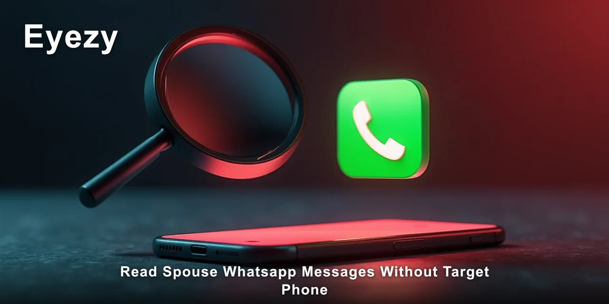
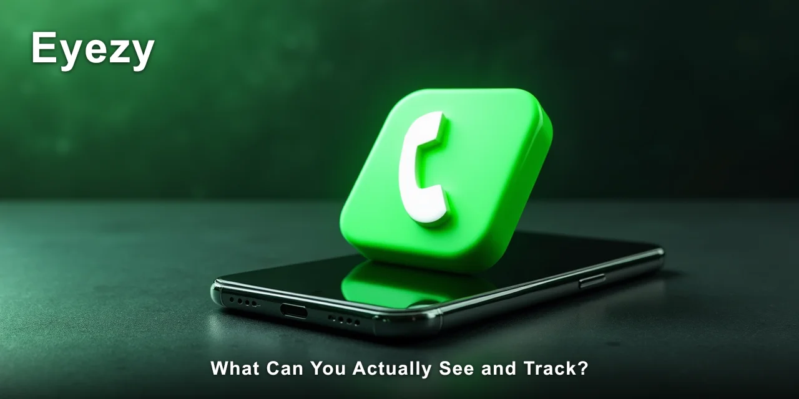

# Read Spouse WhatsApp Messages Without Target Phone: A Realistic Guide

Reading spouse WhatsApp messages without target phone is possible, but only through specific methods that rely on cloud-based data and remote access. The most reliable approach for 2026 involves using a monitoring service that pulls data from iCloud backups, which requires no physical installation on the target device.

This guide explains exactly how that works, what the limits are, and what you should realistically expect.

> [!NOTE]
> **Quick answer:** You can read spouse WhatsApp messages without target phone only on an iPhone, using a monitoring tool that syncs with iCloud. You'll need the spouse's iCloud credentials. Android phones do not offer this option — they always require physical access for installation.

Most people searching for this method are in a difficult place — worried, uncertain, and looking for answers without escalating a confrontation. I've observed this pattern many times, and the most common mistake is jumping into a tool without understanding what it can and cannot do. That gap between expectation and reality is where most beginners get stuck.

🔍 **[Eyezy tracks this without the delays that make most alternatives unreliable.](https://redirectseo.com/e-en)**

## Contents

- [What Does "Without Target Phone" Actually Mean?](#what-does-without-target-phone-actually-mean)
- [What Can You Actually See and Track?](#what-can-you-actually-see-and-track)
- [What Do You Need Before You Start?](#what-do-you-need-before-you-start)
- [Step-by-Step: How a Beginner Gets Started](#step-by-step-how-a-beginner-gets-started)
- [What to Expect in the First Week](#what-to-expect-in-the-first-week)
- [Common Beginner Questions](#common-beginner-questions)
- [✅ Fast Recap](#-fast-recap)
- [Frequently Asked Questions](#frequently-asked-questions)
- [Frequently Asked Questions](#frequently-asked-questions-1)

## What Does "Without Target Phone" Actually Mean?

The phrase "read spouse whatsapp messages without target phone" gets thrown around a lot, but it describes a very specific technical situation. It means you never need to hold the phone, install software on it, or unlock it. All the data flows through a cloud account instead.

This is fundamentally different from standard phone monitoring. With traditional monitoring apps, you install software directly on the device, and that software reads messages locally. Without target phone access, that local route is closed. You're relying entirely on what the phone syncs to the cloud.

| Term | What It Actually Means |
| --- | --- |
| `iCloud backup` | Apple's automatic backup system that stores WhatsApp chats, photos, and app data in the cloud |
| `iCloud credentials` | The Apple ID email and password used to access the iCloud account |
| `Two-factor authentication` | An extra security layer that requires a second code when logging into an account |
| `Jailbreak` | Removing Apple's software restrictions to install unauthorised apps — not needed with this method |
| `Cloud sync` | The process where a device automatically uploads data to an online account |
| `Dashboard` | The web-based control panel where you view all the collected data |

The core limitation is immediate: this only works on iPhones. WhatsApp on Android backs up to Google Drive, and no legitimate monitoring service offers remote access to that data. If the spouse uses an Android phone, you're looking at a different, more invasive approach entirely.

There's also a time factor that beginners rarely consider. iCloud backups happen on a schedule, not in real time. You're seeing a snapshot of past messages, not a live feed. That distinction matters when you're trying to understand a pattern of behaviour.

## What Can You Actually See and Track?

When you read spouse WhatsApp messages without target phone through iCloud sync, you gain access to a substantial set of data. The exact scope depends on how recently the backup was created and whether WhatsApp is configured to include chat history in backups.

- **Message content:** Full text of WhatsApp conversations, including sent and received messages
- **Timestamps:** Exact times and dates for each message
- **Media files:** Photos and videos exchanged within chats, when included in the backup
- **Contact details:** Names and phone numbers associated with each conversation
- **Deleted messages:** Messages removed from the device but still present in older backups

However, there are significant gaps in what you can see. Voice notes are often excluded from iCloud backups depending on WhatsApp settings. Group chat messages may appear only partially. And crucially, you will not see new messages in real time — the data is only as fresh as the last backup cycle.

> [!WARNING]
> Beginners most often overestimate the freshness of iCloud-based monitoring. The data you see could be hours or even days old, depending on when the phone last backed up. This is not live surveillance — it's retrospective viewing.

One capability worth noting is the keylogger feature in **Eyezy**. When the tool is installed on an Android device, it records every keystroke typed on that phone. This picks up WhatsApp messages as they're being typed, before they're even sent. But on the iPhone iCloud route, this feature doesn't apply — you're limited to what the backup contains.

## What Do You Need Before You Start?

Before you attempt to read spouse whatsapp messages without target phone, you need to gather specific items and make some practical decisions. This isn't a five-minute process, and going in unprepared leads to frustration and wasted money.

- [ ] Physical access to the spouse's iPhone for about 10 minutes to check backup settings
- [ ] The spouse's iCloud email address and password
- [ ] Compatibility with two-factor authentication — you may need access to their trusted device
- [ ] A subscription to a monitoring service like **Eyezy** — typically £30–£50 per month
- [ ] A legal basis for monitoring — consent or a legitimate concern that holds up in your jurisdiction

The setup time is roughly 15–20 minutes if you have all the credentials. The learning curve is mild — the dashboard interfaces are designed for non-technical users.

But the two-factor authentication issue is where most people get stuck. If the spouse has Two-Factor Authentication enabled, you'll need either access to their phone once or the recovery code to approve the login.

There's also a cost consideration that beginners often miss. The monitoring subscription is only part of the expense. You may need to increase the iCloud storage plan if the account is full, because WhatsApp backups won't complete without sufficient space. That's an additional £0.79 to £2.49 per month depending on the tier.

## Step-by-Step: How a Beginner Gets Started

This process assumes you have the prerequisites in place — the iCloud credentials, a compatible iPhone, and a clear understanding of the legal position. Follow these steps in order, and don't skip the preparation stages.

1. **Verify iCloud backup settings:** On the spouse's iPhone, go to `Settings → [their name] → iCloud → iCloud Backup` and confirm the toggle is on. Also check `Settings → [their name] → iCloud → Manage Storage → Backups` to see when the last backup occurred.
2. **Confirm WhatsApp backup inclusion:** Open WhatsApp on the target device and go to `Settings → Chats → Chat Backup`. Ensure the backup frequency is set to daily or weekly, and that "Include Videos" is on if you need media.
3. **Create your monitoring account:** Sign up for **Eyezy** from your own device. Choose the subscription plan that matches your needs — longer plans cost less per month but require a larger upfront payment.
4. **Enter the iCloud credentials:** In the Eyezy dashboard, navigate to the setup wizard and enter the spouse's iCloud email and password when prompted. This step is where two-factor authentication will either succeed or block you.
5. **Complete the verification process:** If two-factor authentication is active, you'll receive a code on the spouse's trusted device. You'll need to enter this code within the 30-second window to complete the sync.
6. **Wait for the initial data pull:** The first sync takes between 10 minutes and 2 hours, depending on the size of the backup. You'll see a status indicator in the dashboard showing sync progress.
7. **Review the dashboard:** Once synced, navigate to the WhatsApp section in the Eyezy dashboard. You'll see a list of conversations with timestamps, message content, and attached media.

> [!TIP]
> The single biggest time-saver is verifying the backup settings before you subscribe. Most failed setups happen because the spouse's iCloud backup was disabled or the storage was full. Checking this first takes 5 minutes and prevents days of frustration.

After the initial sync completes, the service will pull new data on the cycle that matches the phone's backup schedule. If the phone backs up nightly, you'll see yesterday's messages each morning. Weekly backups mean weekly updates. There's no way to force a more frequent schedule without access to the phone.

## What to Expect in the First Week

The first week of using iCloud-based monitoring reveals the gap between expectation and reality. Most beginners expect real-time message streaming. What they actually get is periodic data pulls with a noticeable delay. Understanding this difference early prevents unnecessary panic.

| What Beginners Expect | What Actually Happens |
| --- | --- |
| Real-time message viewing as they arrive | Messages appear only after the next backup cycle completes |
| Complete chat history going back months | iCloud may only retain the most recent backup — often 1–2 weeks of data |
| Access to all media including voice notes | Voice notes are frequently excluded from WhatsApp backups |
| Easy setup with just an email and password | Two-factor authentication often requires additional device access |
| Evidence that's immediately usable | Data may be incomplete or outdated, requiring patience to build a picture |

The most common observation I hear from users in that first week is surprise at how little data initially appears. That's normal. The first sync pulls whatever the latest backup contains, which might be a small window of messages. Over time, as new backups occur, the picture fills in.

> [!IMPORTANT]
> The mistake that is hardest to undo is using this data in a way that reveals your access. If you confront your spouse with a message they know they never showed you, the iCloud account will be changed within hours, and you'll lose access permanently. Think carefully about what you do with what you see.

There's also an emotional dimension that nobody prepares you for. Reading messages without knowing the full context can create more anxiety than it resolves. A single message taken out of context can look incriminating when it's actually innocent. I've seen this pattern repeat itself more times than I'd like to admit.

The steadier approach is to let the data accumulate for a week before drawing any conclusions. Patterns matter more than isolated messages. A single late-night text might mean nothing; a consistent pattern of deleted conversations every Sunday evening tells a different story.

Honestly, the sync delay caught me out when I first tested this approach — it's closer to 12–24 hours behind than the real-time view most people imagine. That delay changes how you interpret what you see.

## Common Beginner Questions

### Is it legal to read spouse WhatsApp messages without target phone?

The legality varies significantly by jurisdiction. In most regions, monitoring someone's private communications without consent violates privacy laws, even between spouses.

Some states in the US have specific exceptions for shared devices or marital property. You should consult a legal professional in your area before proceeding.

The risk is real — evidence obtained illegally is often inadmissible in court, and you could face civil liability.

### Does this method work on Android phones?

No. Reading spouse WhatsApp messages without target phone is only possible on iPhones through iCloud. Android devices back up WhatsApp data to Google Drive, and no monitoring service currently offers remote access to that data. For Android, you would need physical access to the phone for installation, which defeats the "without target phone" requirement.

### Can I see deleted messages with this method?

Sometimes. If a message was deleted after the most recent backup was created, it will still appear in that backup. However, once a new backup runs without that message, the deleted content is gone. This method captures deleted messages only within the backup window — typically 24 hours for daily backups.

### How fresh is the data I'm seeing?

The data freshness depends entirely on the backup schedule on the target phone. If WhatsApp is set to back up nightly at 2am, you'll see messages up to that point each morning. If backups are weekly, you'll wait longer. There is no way to trigger an on-demand backup without accessing the phone.

### What if two-factor authentication is enabled on the iCloud account?

This is the most common blocker. You'll need either the spouse's phone temporarily to approve the login, or access to the recovery code. Some monitoring services offer workarounds, but they're unreliable. The cleanest solution is to reset the password while you have brief access to the phone, then complete the setup with the new credentials.

### Will the spouse know I'm monitoring them?

No — this is the key advantage of the iCloud method. Since nothing is installed on the target device, there's no app icon to find and no notification to trigger.

Eyezy operates entirely from the cloud side, so the spouse's phone shows no trace of monitoring. The only risk is if they notice the iCloud login activity in their account settings.

### What happens if the iCloud storage is full?

WhatsApp backups will fail completely, and you'll see no new data. This is more common than you'd think — many iPhone users ignore storage warnings. You'll need to purchase additional iCloud storage on the spouse's account, which means adding a payment method or using a gift card. This can be done remotely if you have the account password.

## ✅ Fast Recap

- Reading spouse WhatsApp messages without target phone only works on iPhones via iCloud sync
- You need the iCloud email and password, plus a way to handle two-factor authentication
- Android phones cannot be monitored without physical installation — no exceptions
- Data is not real-time — it updates on the phone's backup schedule
- Deleted messages appear only if they exist in the most recent backup
- Legal consent and local privacy laws matter significantly before you start
- Setup takes 15–20 minutes, but the first full sync can take up to 2 hours

You now understand the full picture — the method, the limits, and the practical steps. The iCloud route is the only legitimate way to read spouse WhatsApp messages without target phone access, and it works reliably when the prerequisites are in place.

✅ **[Eyezy fills the exact gap this article describes, without requiring a second tool.](https://redirectseo.com/e-en)**

## Frequently Asked Questions

### Will I see WhatsApp messages in real time?

No. The data appears only after the phone completes its next backup cycle. For most users, that means a daily update showing the previous 24 hours of messages. This is a fundamental limitation of the iCloud method — there's no real-time option without installing software on the phone.

### Can I read WhatsApp messages from a backup that's months old?

Only if that backup still exists. iCloud typically keeps the most recent backup for each device, though some users have multiple backups if they've backed up to different points. In practice, you'll usually see the last 1–2 weeks of messages, not months of history.

### What if the spouse uses WhatsApp Web or WhatsApp Desktop?

Those sessions mirror the phone's messages in real time, but they don't create separate backups. The iCloud method still captures the same data, just on the backup schedule. The monitoring dashboard won't show which device was used to send a message.

By this point, you've seen the realistic picture of what's possible and what isn't. The key is matching your expectations to the actual capabilities — cloud-based monitoring is retrospective, not instantaneous.

🔗 **[See the current Eyezy plans and features](https://redirectseo.com/e-en)**

## Frequently Asked Questions

### Is reading spouse WhatsApp messages without target phone considered spying?

Technically, yes — you're accessing someone's private communications without their knowledge. The legal implications depend on your jurisdiction and whether you have a legitimate basis. Some countries permit monitoring if you own the phone or pay for the service. Others require explicit consent from both parties.

### How long does the subscription need to be active?

Most people maintain the subscription for 1–3 months while they gather the information they need. There's no minimum commitment with most services, and you can cancel anytime. The longer you monitor, the more pattern data you accumulate, but the cost adds up quickly.

### Can I export the messages as evidence?

Most monitoring dashboards, including **Eyezy**, offer export or screenshot capabilities. However, this evidence may not hold up in legal proceedings if it was obtained without consent. Check with a lawyer before relying on this data in court. For personal clarity, the dashboard view is usually sufficient.

### What should I do if the sync fails repeatedly?

First, verify the iCloud credentials are correct and the storage isn't full. Then check the backup settings on the target phone — if backups are disabled, no monitoring tool can help. Finally, contact the service's support team. Most issues trace back to authentication or storage problems, not the monitoring software itself.

### Are there any free methods to read spouse WhatsApp messages without target phone?

No. Every legitimate method requires a paid subscription because the technology involved — cloud sync, data parsing, dashboard hosting — has real costs. Free tools claiming to offer this service are almost always scams designed to steal your credentials. Avoid them entirely.